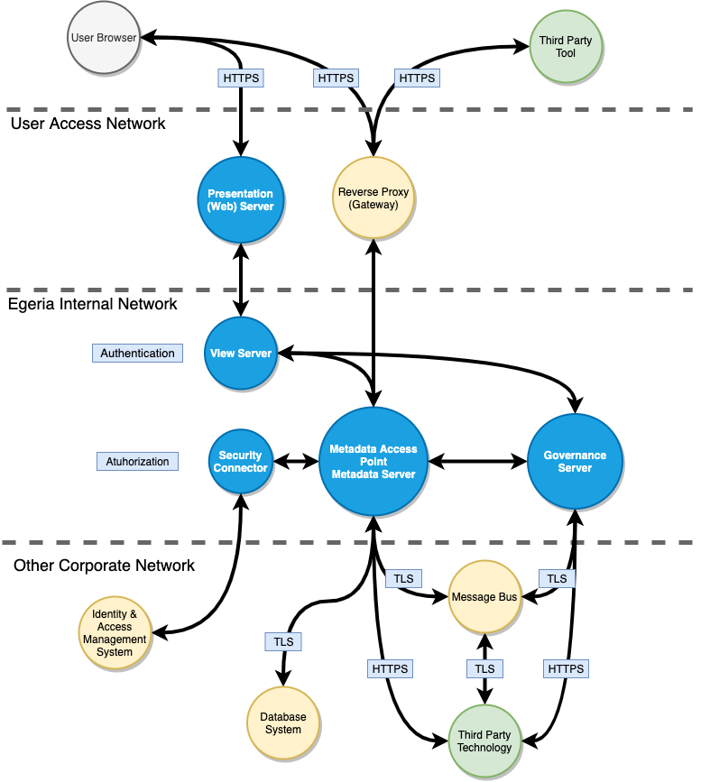

# Building a Threat Model

Threat modeling is a process by which potential threats, such as structural vulnerabilities or the absence of appropriate safeguards, can be identified, enumerated, and mitigation can be prioritized. 
It is recommended that consumers embrace threat modeling technique and walk through series of concrete steps in order to fully understand the environment and specific solution you are trying to build and secure. 

Thread modeling should at the end answer questions like:

- Where am I most vulnerable to attack? 
- What are the most relevant threats?
- What do I need to do to safeguard against these threats?

Egeria's architecture allows consumers to make specific choices and minimize risk factors from the early solution design phase.
Here we outline some generic aspects that can help you to build model specific to your solution using Egeria Open Metadata Platform.

### Decomposing the solution and identifying data flows

- Identify high level application components; 
- Identify metadata flows;
    - How metadata is stored?
    - How metadata is accessed?
- Identify how Egeria interacts with external entities;
    - How metadata is exchanged? 
- Identify Trust boundaries and security measures;

Common data flow patterns between components in Egeria solution:

### Determine possible threats
Most common threat categories following [STRIDE](https://docs.microsoft.com/en-us/previous-versions/commerce-server/ee823878(v=cs.20)?redirectedfrom=MSDN) methodology each violating some aspect of the CIA triad.

#### Spoofing identity

Native support 

Egeria does not store and manage sensitive user identity information such as usernames with passwords. 
Egeria Open Metadata Security module delegates this responsibility to dedicated security connectors that can be developed to integrate with external Identity Management system.

Learn more about [Open Metadata Security](https://egeria.odpi.org/open-metadata-implementation/common-services/metadata-security/).

#### Tampering with data

Native support

Access to metadata in Egeria platform is also controlled by Open Metadata Security connectors. 
You can configure and use security API to introduce access control on different levels like Platform and Server. 
Furthermore, Open Metadata Server Security Connector APIs allow fine-grained access control to metadata.
  
Lear more about [Open Metadata Security connectors](https://egeria.odpi.org/open-metadata-implementation/common-services/metadata-security/metadata-security-apis/).

#### Repudiation
Native support

Egeria platform uses its AuditLog framework help with diagnostics, auditing and data repudiation threats. All system events, user operations are recorded and published to AudiLog subsystem. 
You can configure different severity levels and extend this framework to send audit log trails to variety of external systems. 

Lear more about [Diagnostics and Auditing](https://egeria.odpi.org/open-metadata-publication/website/diagnostic-guide/). 

#### Information disclosure
Native support

Egeria supports transport level security for its components to minimize information disclosure on the data in transit.
Although SSL/TLS is enabled by default in the Egeria Open Metadata Platform, it is strongly recommended that consumers configure all components using strong encryption and preferred trusted PKI.

#### Denial of service
Some support

Some core Egeria components are designed to counter threats like DoS. Measures like MaxPageSize on APIs that read metadata or throttling mechanism for the React UI login page.
However, consumers should also plan to mitigate these threats on infra/service level by enforcing additional counter measures on key components such as Gateways (Revers Proxy). 

#### Elevation of privilege

It is strongly advised that multiple mitigation factors are in place on infrastructure level. Some include principle of least privilege and Application security monitoring.

