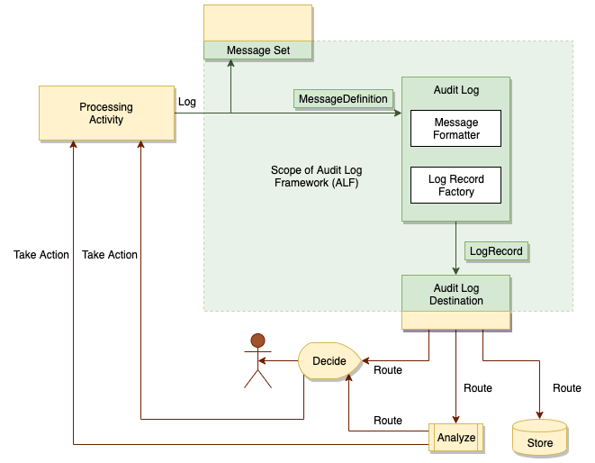

<!-- SPDX-License-Identifier: CC-BY-4.0 -->
<!-- Copyright Contributors to the ODPi Egeria project 2020. -->

# Audit Log Framework (ALF)

The Audit Log Framework (ALF) provides interface definitions
and classes to enable connectors to support natural language enabled
diagnostics such as exception messages and audit log messages.

The audit log framework provides the ability to
route audit log messages to multiple destinations
where they can be stored or processed automatically.
This second option is particularly important in today's world of
continuous operations.

Figure 1 shows the main parts of the framework.

> **Figure 1:** Components of the Audit Log Framework (ALF)

When processing activity wishes to log a message to the audit log, it selects
a message definition from a message set, optionally passing in the
values to fill out the placeholders in the message template.

The message definition is passed to the audit log where it
calls the message formatter, builds a log record and
passes it on to the audit destination.

The audit log destination can be extended
to allow routing to different destinations for review and processing.

## Use of the Audit Log Framework

The [Open Metadata Repository Services (OMRS)](../../repository-services/docs/component-descriptions/audit-log.md)
provides an extension to the audit log destination that supports
audit log store connectors.
This means that an OMAG Server can be configured to route 
audit log messages to different destinations.

Details of the supported audit log store connectors and
how to set them up are described in
[Configuring the Audit Log](../../admin-services/docs/user/configuring-the-audit-log.md).

----
Return to [frameworks](..).

----
License: [CC BY 4.0](https://creativecommons.org/licenses/by/4.0/),
Copyright Contributors to the ODPi Egeria project.