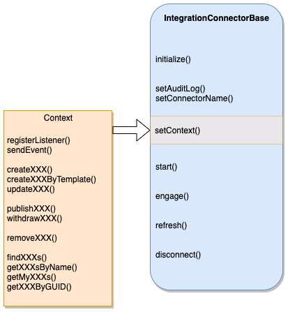
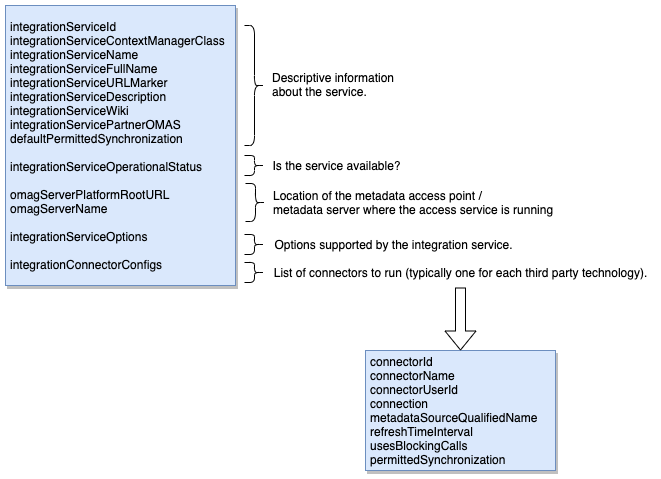

<!-- SPDX-License-Identifier: CC-BY-4.0 -->
<!-- Copyright Contributors to the ODPi Egeria project 2020. -->

# Integration Connector

An integration connector is a pluggable component that
manages the metadata exchange to a third party technology.
It is hosted in an [integration service](../../../integration-services)
which is, in turn, running in an [Integration Daemon](../../../admin-services/docs/concepts/integration-daemon.md).
 
The integration connectors can:
 * Listen on a blocking call for the third party technology to send a notification.</li>
 * Register with an external notification service that sends notifications on its own thread.
 * Register a listener with the OMAS client to act on notifications from the OMAS's Out Topic.
 * Poll the third party technology each time that the refresh() method is called.

Figure 1 shows the method calls for the integration connector.

> **Figure 1:** Methods implemented by an integration connector.

* **initialize** - standard method for all connectors that is called by the
[OCF Connector Broker](../../../frameworks/open-connector-framework/docs/concepts/connector-broker.md)
when the connector is created.  The connector is passed the Connection object from the
configuration and a unique identifier for this instance of the connector.

* **setAuditLog** - provides a logging destination (see [Audit Log Framework (ALF)](../../../frameworks/audit-log-framework)).
* **setConnectorName** - provides the name of the connector for logging.

* **setContext** - sets up the integration specific context.
This provides an interface to the services of the OMAS that the integration service is paired with.
Although the interfaces vary from integration service to integration service,
they typically offer the following types of method call
for each type of metadata it supports:

  * The ability to register a listener to receive events from the OMAS's out topic, or send
  events to the OMAS's in topic.
  
  * the ability to create and update metadata instances.
  
  * for assets the ability to change an asset's visibility by changing
  its zone membership using the publish and withdraw methods.
  
  * the ability to delete metadata 
  
  * various retrieval methods to help when comparing the metadata in the open metadata
  repositories with the metadata in the third party technology.

* **start** - indicates that the connector is completely configured and
can begin processing.
This call can be used to register with
non-blocking services.
For example it can register a listener with the
OMAS Out Topic with the context.

* **engage** - used when the connector is configured to need to issue blocking calls to wait for new metadata.
It is called from its own thread. It is recommended that the engage() method returns when each blocking call completes.
The integration daemon will pause a second and then call engage() again. This pattern enables the calling thread to
detect the shutdown of the integration daemon server.
 
* **refresh** - requests that the connector does a comparison of the metadata
in the third party technology and open metadata repositories. 
Refresh is called (1) when the integration connector first starts and then (2) at
intervals defined in the connector's configuration as well as (3) any external REST API calls to explicitly refresh the connector.

* **disconnect** - called when the server is shutting down.  The connector should free up
any resources that it holds since it is not needed any more.

## Integration connector configuration

The integration connector's connection is configured as part of the
integration service configuration

## Further reading

* [Open Connector Framework (OCF)](../../../frameworks/open-connector-framework) that defines the behavior of
all connectors.
* [Configuring the integration services](../../../admin-services/docs/user/configuring-the-integration-services.md) to
understand how to set up an integration connector.
* [Developer guide](../../../../open-metadata-publication/website/developer-guide) for more information on writing connectors.

----
* Link to the [Integration Daemon](../../../admin-services/docs/concepts/integration-daemon.md).
* Link to the [Integration Services](../../../integration-services).

----
License: [CC BY 4.0](https://creativecommons.org/licenses/by/4.0/),
Copyright Contributors to the ODPi Egeria project.