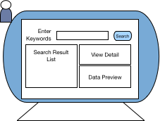
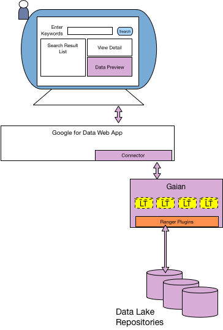

<!-- SPDX-License-Identifier: Apache-2.0 -->
 
# Walk-through of the VDC use case

Figure 1 shows a mock-up of
the **[catalog search UI](../../../open-metadata-implementation/user-interfaces/access-services-user-interface/README.md)** that the VDC supports.
A person can enter search queries and a list of potential data
sources are displayed on the left-hand side of the screen.
Selecting one of the search results causes more details of the metadata for
that entry to be displayed in the top right-hand side of the screen and underneath it,
a preview of the data if the end user has permission to access the data.

**Figure 1: Catalog self service UI**

At the start of the use case, details of the data repositories,
the mappings to the business glossary terms and the security classifications
are managed in IBM's Information Governance Catalog.  This is shown in Figure 2.

**Figure 2: IBM's Information Governance Catalog (IGC) holding data lake metadata**

The first step is to replicate the metadata from IGC to Apache Atlas so it can be extended to support the virtual views.

This is shown in Figure 3.

**Figure 3: Replicating metadata from IGC to Apache Atlas**

Since IGC remains the master copy of the original metadata,
the replication must be ongoing so that Apache Atlas remains up to date with the
latest metadata from IGC.

Thus the replication capability listens for
IGC events and converts them into OMRS events that can then be used to
drive updates through the OMRS repository connector API to the Apache Atlas repository.

The virtualizer is an optional component of the OMAG server that receives notifications
from the open metadata repositories through the 
[Information View OMAS](../../../open-metadata-implementation/access-services/information-view/README.md)
event topic and builds logical tables in Gaian as well and the
corresponding information view metadata in an open metadata repository.

[Gaian](../../../open-metadata-implementation/adapters/open-connectors/data-store-connectors/gaian-connector/README.md) is
an open source information virtualization technology.
The virtualizer is written to be modular so calls to a different virtualization
technology can be made at this point with a small change to the virtualizer. 

The aim at the VDC demo is to prove that an open metadata repository can dynamically
configure an information virtualization technology.
See Figure 4.

**Figure 4: Building information views with the virtualizer**

Using a similar technique, the synchronization processes for Apache Ranger
pick up knowledge from the Governance Action OMAS that the Information Views
have been created/changed in Apache Atlas.
They push appropriate metadata to control access to the Apache Ranger server
which then configures 
Apache Ranger plugins in Gaian.
See Figure 5.

**Figure 5: Configuring enforcement points in Gaian using Apache Ranger**

The Apache Ranger plugins hosted in Gaian cache all of the metadata they need
to make access decisions based on the user information passed on a request.

The system is now configured.
Subsequent changes to the IGC metadata will ripple through Apache Atlas, then the Virtualizer,
Apache Ranger and Gaian so they are consistent and up-to-date.

When the end user makes a search request, or clicks on a search result to see more detail, the request and response comes through the Catalog OMAS to Apache Atlas.
See Figure 6.

**Figure 6: Requesting catalog information from Apache Atlas**

When the data preview is requested, Gaian is called to extract the data.
The Apache Ranger plugins validate the access request allowing Gaian to retrieve
the data from the data lake.
See Figure 7.

**Figure 7: Requesting data from Gaian**

Figure 8 summarizes the whole end-to-end flow.

**Figure 8: End to end flow**